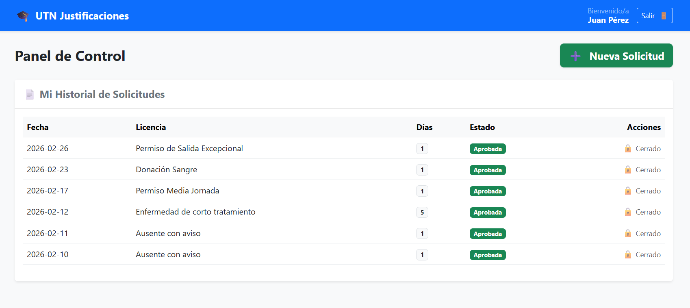
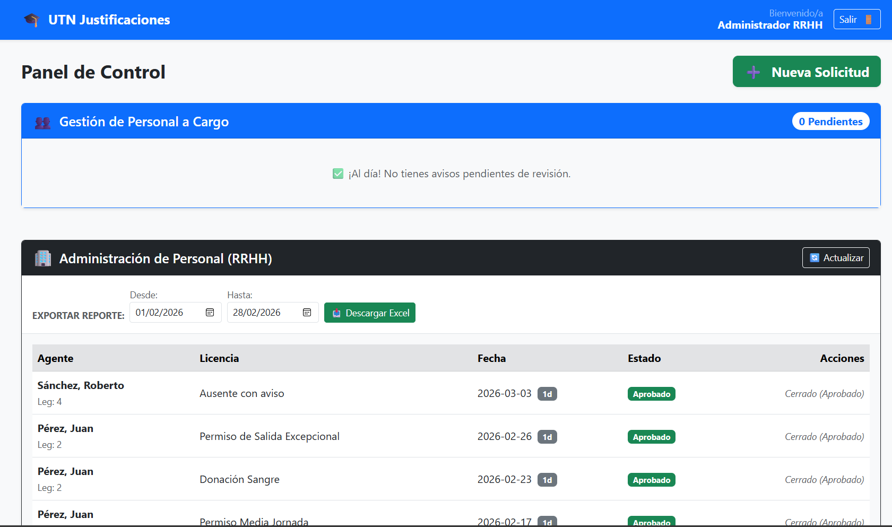

# 🎓 Sistema de Gestión de Justificaciones (UTN)

Sistema web Full Stack para la digitalización y automatización del proceso de solicitud, revisión y aprobación de licencias en la Universidad Tecnológica Nacional.

![Captura del Sistema]

### Pantalla de Login


### Pantalla Principal



### Pantalla Aprobación



## 🚀 Características Principales

- **Roles Diferenciados:** Agentes, Jefes (Aprobadores) y RRHH.
- **Gestión Jerárquica:** Asignación automática de superiores basada en Áreas y Categorías.
- **Digitalización:** Generación automática de PDFs de respaldo (WeasyPrint).
- **Seguridad:** Autenticación robusta, validación de PIN para firma digital.
- **UX Moderna:** Interfaz reactiva con Vue.js, diseño responsivo y notificaciones en tiempo real.

## 🛠️ Tecnologías Utilizadas

### Backend

- **Python / Django REST Framework:** API RESTful robusta.
- **SQLite:** Base de datos relacional (Scalable a PostgreSQL).
- **WeasyPrint:** Motor de generación de reportes PDF.

### Frontend

- **Vue.js 3 (Composition API):** Framework reactivo.
- **Bootstrap 5:** Diseño UI/UX responsivo.
- **Axios:** Comunicación asíncrona con el API.

## 📦 Instalación y Puesta en Marcha

1.  **Clonar el repositorio:**

    ```bash
    git clone [https://github.com/feermza/sistema_justificaciones.git] (https://github.com/feermza/sistema_justificaciones.git)
    ```

2.  **Backend (Django):**

    ```bash
    cd backend
    pip install -r requirements.txt
    python manage.py migrate
    python manage.py runserver
    ```

3.  **Frontend (Vue.js):**
    ```bash
    cd frontend
    npm install
    npm run dev
    ```

## 📄 Licencia

Este proyecto está bajo la Licencia MIT.

---

**Desarrollado por Fernando Adaro**
